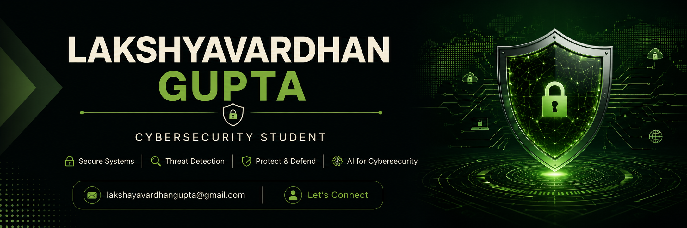

  

 
# Hi 👋 I'm Lakshyavardhan Gupta

### Cybersecurity Student | AI Security Enthusiast

I'm passionate about building AI-powered cybersecurity tools and learning offensive and defensive security.

## About Me

🎓 B.Tech Cybersecurity Student

🔐 Interested in

- SOC Operations
- GRC
- Vulnerability Assessment
- Threat Detection
- AI for Cybersecurity

🌱 Currently Learning

- Python
- Linux
- Networking
- SIEM
- SOC Analysis
- OWASP
- MITRE ATT&CK

---

## Tech Stack

Python

Flask

Streamlit

Git

GitHub

Linux

Nmap

OWASP ZAP

AI / LLM

SQLite

---

## Featured Projects

### AI SecureOps

An AI-powered security dashboard featuring:

- Live Packet Capture
- Risk Analysis
- AI Threat Detection
- Vulnerability Scanning
- Secret Detection
- AI Anomaly Detection

---

### AI Vulnerability Scanner

Upload scanner reports and receive:

- AI Security Analysis
- Risk Prioritization
- Remediation Recommendations
- Professional PDF Reports

---

## Currently Working On

- AI Security Automation
- SOC Dashboard
- GRC Learning
- Threat Intelligence

---

## Reach Me

📧 lakshayavardhangupta@gmail.com

LinkedIn:
(www.linkedin.com/in/lakshyavardhan-gupta)
